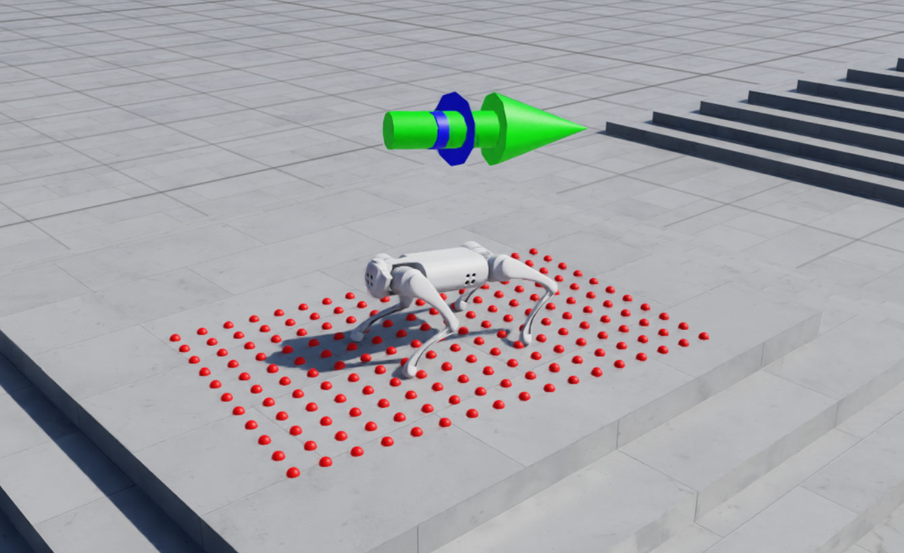
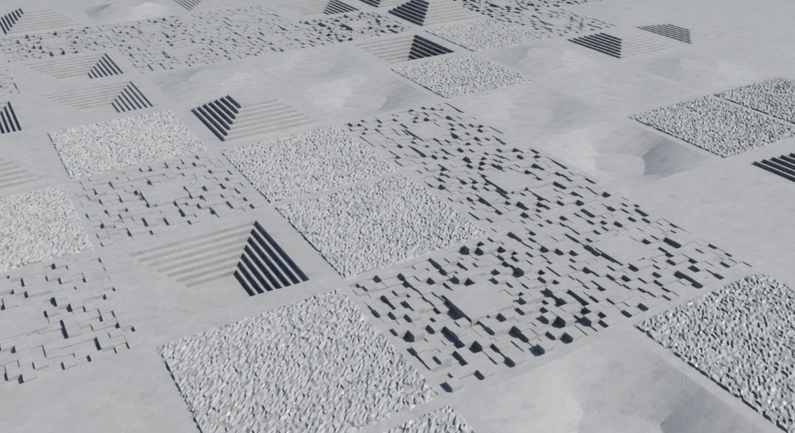

# Blind Locomotion Over Challenging Terrain in Isaac Lab


## GitHub Repository Link: 
Public repository: 

https://github.com/toenails6/Blind_Locomotion_Go1

## Overview
This project is an (on-going) imitation of *Learning Quadrupedal Locomotion over Challenging Terrain* by *Joonho Lee*, et al. 
The original work was trained and simulated in Raisim, which is proprietary and not freely available for academic use. 
It is the hopes of this work to imitate the contributions and results of the mentioned research through Nvidia's free and open-source Isaac Lab framework. 

The training environment is designed to fit most quadrupedal robots, especially those documented in Isaac Lab's assets. 
The currently used robot is Unitree Go1. 

Due to technical limitations, not all details of this work can fully match the original work, as Isaac Lab and Raisim offer different terrain generators, and other functions etc. 
In terms of algorithms, this work will use the SKRL library (which directly couples with Isaac Lab), and Proximal-Policy-Optimization. 
Despite details, the ultimate goal is to recreate an exteroceptive privileged-information trained RL teacher network, to then train a subsequent student network that relies solely on proprioceptive information. 

## Terrain types
The original paper used three terrain types, including hills, stairs, and boxes. 
Isaac Lab does not explicitly offer terrains of hill type, and stairs are generated in the form of symmetrical pyramids instead of mono-direction ascents. 
Here, a combination of random uniform terrain, slopes and pyramids serve as a good alternative, containing various similar terrain features. Check details in `source/
Blind_Locomotion_Go1/
Blind_Locomotion_Go1/
tasks/manager_based/
blind_locomotion_go1/
Blind_Locomotion_Terrain.py`: 



## Teacher network MDP layout
The Markov-Decision-Process layout of the teacher network will be summarized in this section, with some highlights on the differences from the original work. 

### Commands
The robot is commanded to move in designated velocities in the x and y axes directions. 
```
base_velocity = mdp.UniformVelocityCommandCfg(
    asset_name="robot",
    resampling_time_range=(10.0, 10.0),
    rel_standing_envs=0.02,
    rel_heading_envs=1.0,
    heading_command=True,
    heading_control_stiffness=0.5,
    debug_vis=True,
    ranges=mdp.UniformVelocityCommandCfg.Ranges(
        lin_vel_x=(-1.0, 1.0), 
        lin_vel_y=(-1.0, 1.0), 
        ang_vel_z=(-1.0, 1.0), 
        heading=(-math.pi, math.pi)
    ),
)
```
- A new command is given every 10 seconds. 

- $2\%$ of the robots are commanded to stand still. 

- All robots are given specific target headings, and the z-axis angular velocities will be calculated from the errors to the target headings. 

- Maximum linear speeds are set as $1m/s$, and maximum angular speeds are set as $\pi/s$. 

### Actions
The robot will be controlled via target positions for all of its joints. 
```
joint_pos = mdp.JointPositionActionCfg(
    asset_name="robot", 
    joint_names=[".*"], 
    scale=0.5, 
    use_default_offset=True)
```
Note that the original work implements a cubic Hermite spline cycled foot trajectory generator (FTG), and outputs FTG phases and frequencies as commands. 
This does not play too well with penalizing frequent feet to ground contact. 
Thus, direct joint position targets are used as actions here. 
Though, this might reduce robot locomotion effectiveness over rougher terrains, and is up to potential changes. 
Specifically, if frequent feet to ground contact is not penalized, and the legs are free to jitter, then there is a higher chance of the legs breaking free of obstacles. 

### Observations
The observations for the teacher MDP is defined in a single class that can contain multiple groups of observations of different types. 
Having different groups while setting auto concatenate to `True` does not seem to affect network architecture settings (besides from necessary network sizes), as Isaac Lab will auto handle the passing of observations to the RL library in use. 
This might be useful for separating the network input encoders for potential network weight transfers in the future. 

Check details in `source/
Blind_Locomotion_Go1/
Blind_Locomotion_Go1/
tasks/manager_based/
blind_locomotion_go1/
Blind_Locomotion_env.py`: 
```
@configclass
class ObservationsCfg:
    """Observation specifications for the MDP."""
    ...
```

- The velocity of the robot is taken as the velocity of the trunk, and is given a uniform noise within $(-0.1, 0.1)$. 

- The commands, actions (target joint positions), current joint positions, and joint velocities values are all observations given to the MDP. 

- Currently a height scan around the robot trunk is given as observations to the MDP. This will be changed to height scans around the robot's feet in the future, similar to the original work. 

Exteroceptive terrain information is yet to be added, as all robots are trained on the same terrain primitive. 
Robot body part friction coefficients can be randomized instead, and corresponding codes are already implemented, but does need further tuning. 

### Rewards
Check details in `source/
Blind_Locomotion_Go1/
Blind_Locomotion_Go1/
tasks/manager_based/
blind_locomotion_go1/
Blind_Locomotion_env.py`: 
```
@configclass
class RewardsCfg:
    """Reward terms for the MDP."""
    ...
```
- Trunk z-axis linear velocity is penalized. 

- Trunk x-y-axis angular velocity is penalized. 

- Trunk motion tracking with command is rewarded. 

- Joint torques are penalized. 

- Joint accelerations are penalized. 

- Longer steps, which means longer feet in air time, is rewarded. 

- Thigh contacts with terrain is penalized. 

The primary difference between the original work is that the original work rewards foot clearance based on the FTG, to have the robot avoid feet/shank collision with terrain. 
This is yet to be explicitly implemented here due to action set differences. 

Note that reward weights are specified in the robot specific training environment configuration: `UnitreeGo1_BlindLocomotionEnvCfg`. 

### Events
Check details in `source/
Blind_Locomotion_Go1/
Blind_Locomotion_Go1/
tasks/manager_based/
blind_locomotion_go1/
Blind_Locomotion_env.py`: 
```
@configclass
class EventCfg:
    """Configuration for events."""
    ...
```
- The generated terrain is a single entity for all robots in the training episode. And so has maximum friction settings of 1. Frictions settings will differ between the generated robots. 

- Each time robots are regenerated, randomized physics settings, such as friction coefficients, masses, and inertias will be assigned. 

- Robots currently have external disturbance terms, such as external torque and forces, but are set to 0. Further tuning is needed. 

- Robots are generated in random positions and initial states in their own terrain designated by the Isaac Lab curriculum manager. 

Events are context dependent and are not compared with the original work. 

### Terminations
Robots are to be terminated and regenerated under certain conditions: 
```
@configclass
class TerminationsCfg:
    """Termination terms for the MDP."""

    time_out = DoneTerm(func=mdp.time_out, time_out=True)
    base_contact = DoneTerm(
        func=mdp.illegal_contact,
        params={
            "sensor_cfg": SceneEntityCfg(
                "contact_forces", body_names="base"), 
            "threshold": 1.0},
    )
```
- Robot terminates after MDP iteration timeout. 

- Robot terminates when its trunk hits the floor. (Lazy Dog, Bad Boy)

Terminations are context dependent and are not compared with the original work. 

## Auto curriculum
The curriculum is based on the distance the robot walked when commanded to move at a desired velocity. 

The difficulty of the terrain increases when the robot walks far enough and decreases when the robot walks less than half the distance required by the commanded velocity. 
```
@configclass
class CurriculumCfg:
    """Curriculum terms for the MDP."""

    terrain_levels = CurrTerm(func=mdp.terrain_levels_vel)
```

## Coding Caveats
- The `BlindLocomotionCfg` class is an overarching MDP definition class that defines abstracted information regarding commands, observations, and so on. 

- All corresponding sensors are added in the scene configuration file, check details in:  
`.../blind_locomotion_go1/Blind_Locomotion_Scene.py`

- Specific primitive names differ from robot to robot, and so primitive paths that define some of the terms are different. These are modified in a robot specific environment class, such as `UnitreeGo1_BlindLocomotionEnvCfg`
- Refer to Isaac Lab official documentation and/or `ISAACLAB.md` for installation of this repository. 

- Isaac Lab official documentation:  
https://isaac-sim.github.io/IsaacLab/main/index.html

## Current status and Work in Progress
The current teacher network is trainable and functional, but can still be modified and tuned to be more closer to the teacher network in the original work. 
Primary differences to be worked on involve adding the terrain friction information to the teacher observations, and application and observation of external force disturbances. 

When this tuning is complete, the next step is to train a student network from the teacher network. 
The original work implements a hybrid approach of distillation and weight transfer, where the exteroceptive information encoder will be distilled to a joint history encoder, and the action encoders are simply copied (weight transferred). 
This work is yet to implement a student network, so the exact methods are undetermined. 
As of now, the plan is to first attempt a complete distillation of the teacher network without weight transfer, and then see whether a hybrid approach is possible. 
If both are possible, there will be a comparison between the completely distilled network, and the hybrid trained network. 

In the end, the student network will be either put to a teleoperated simulation game in Isaac Lab, or, if circumstances allow, put to an actual Unitree Go1 robot for testing. 
